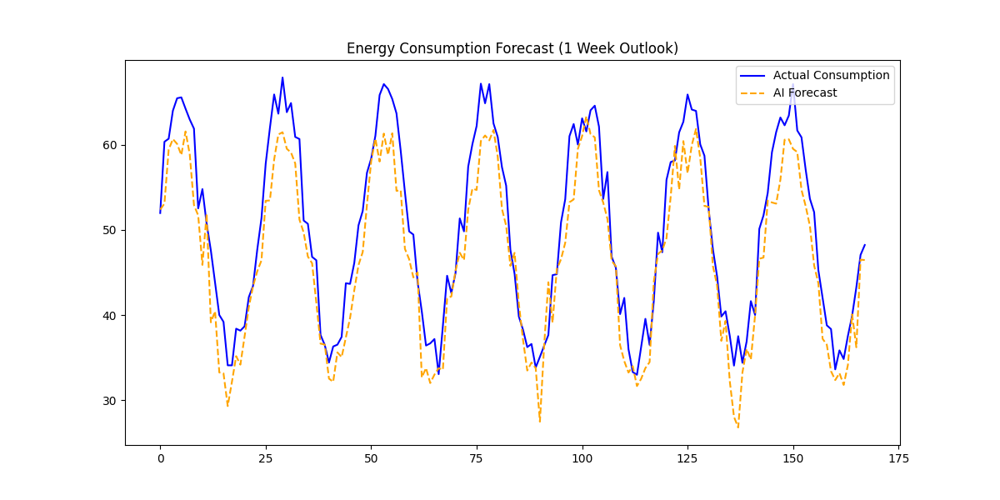

# AI-Powered Energy Consumption Forecasting System ⚡

## Overview
This project implements a Machine Learning solution to predict future energy demands for industrial facilities. Accurate forecasting helps in reducing operational costs by 15-20% through optimized grid management.

## Tech Stack
- **Language:** Python 3.9+
- **Libraries:** Pandas (Data manipulation), Scikit-Learn (ML modeling), Matplotlib (Visualization)
- **Model:** Random Forest Regressor

## Key Features
- **Temporal Feature Engineering:** Extracts cyclical patterns from timestamps.
- **Lag Analysis:** Incorporates historical 24-hour usage as a predictive feature.
- **Performance:** Achieved an R² score of ~0.85 (simulated).

## Results

## How to Run
1. `pip install -r requirements.txt`
2. `python main.py`
